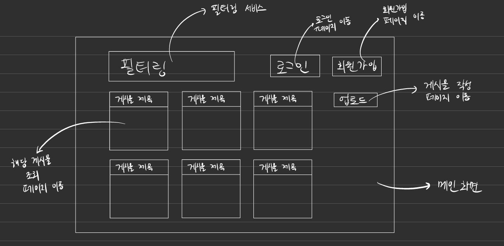
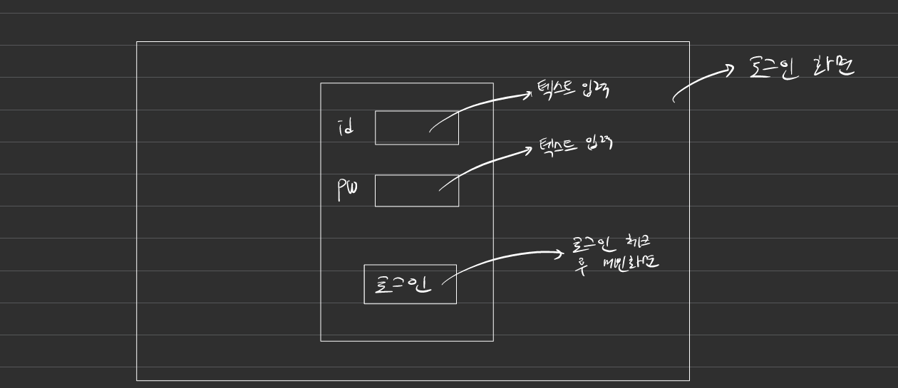
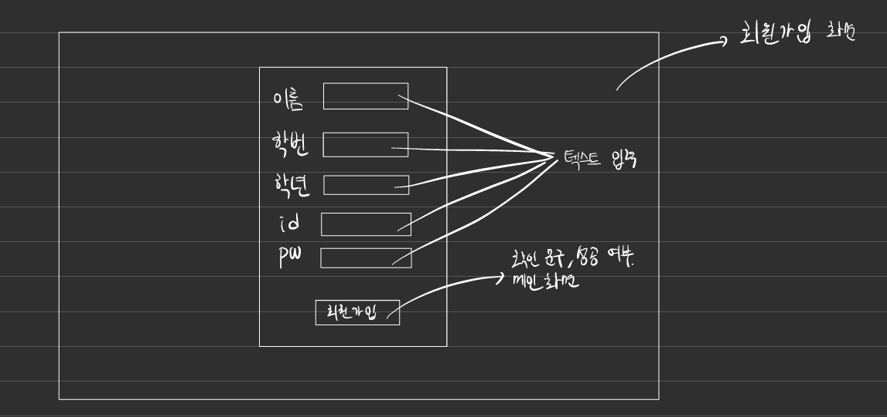
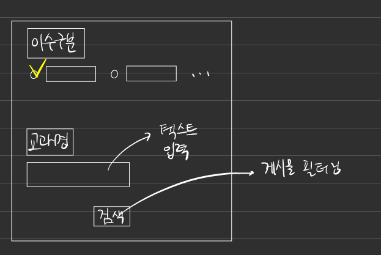
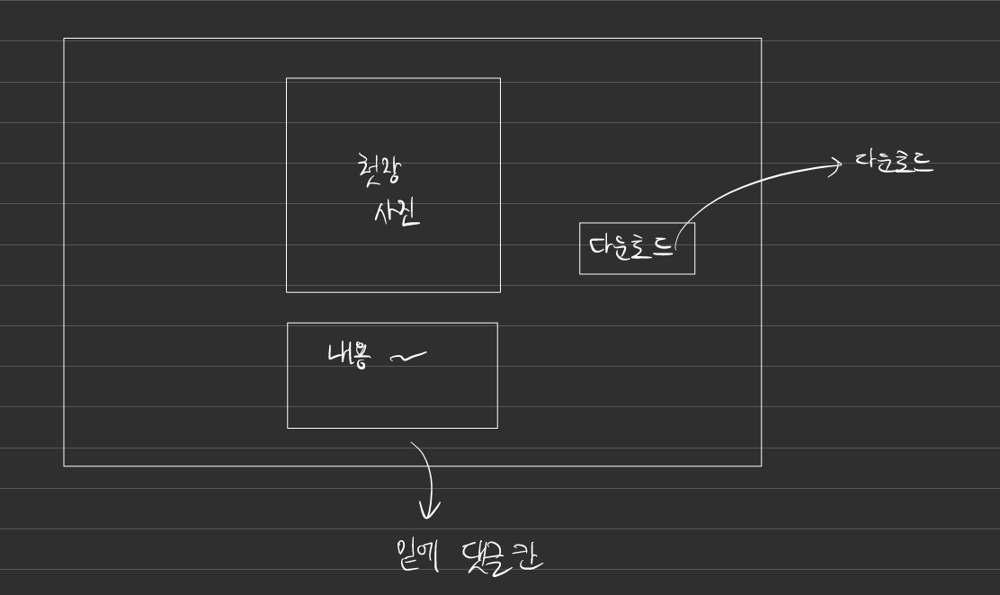

# 📝 요약 노트 공유 플랫폼

- 프로젝트 명: 대학교 요약 노트 공유 플랫폼
- 팀명: 개학
- 팀원명: 허민엽, 이재황, 신예진, 채종화

---

## 🙋 주제 선정 배경

- 시험 때마다 요약 자료를 찾기 어려움
- 학생들이 만든 노트를 서로 공유하면 더 효율적인 공부 가능

---

## 🎯 프로젝트 목표

- 학생들이 직접 작성한 노트를 업로드하고 공유하는 웹 서비스 제공
- 댓글 기능을 통해 학생들 간 소통 지원
- PDF 첫장 미리보기 및 다운로드 기능 제공

---

## 🧩 주요 기능 요약

- 회원가입 / 로그인
- 노트 업로드 및 미리보기 (PDF 첫 장 이미지)
- 과목명/이수구분/ 검색 및 필터 시스템
- 댓글 기능
- 다운로드 및 파일 정보 표시

---

## ⚙️ 기술 스택

| 항목 | 기술 |
|------|------|
| 프론트엔드 | HTML/CSS, JavaScript |
| 백엔드 | Node.js |
| 데이터베이스 | MySQL |
| 기타 | 파일 업로드, 다운로드 |

---

## 💡 기대 효과

- 시험 대비 시간 단축
- 요약 노트를 통한 지식 공유 문화 확산
- 백엔드-프론트 통합 웹앱 개발 경험

---

---

---

---

---

---

## ❓ QNA

감사합니다.
질문 있으시면 자유롭게 해주세요 